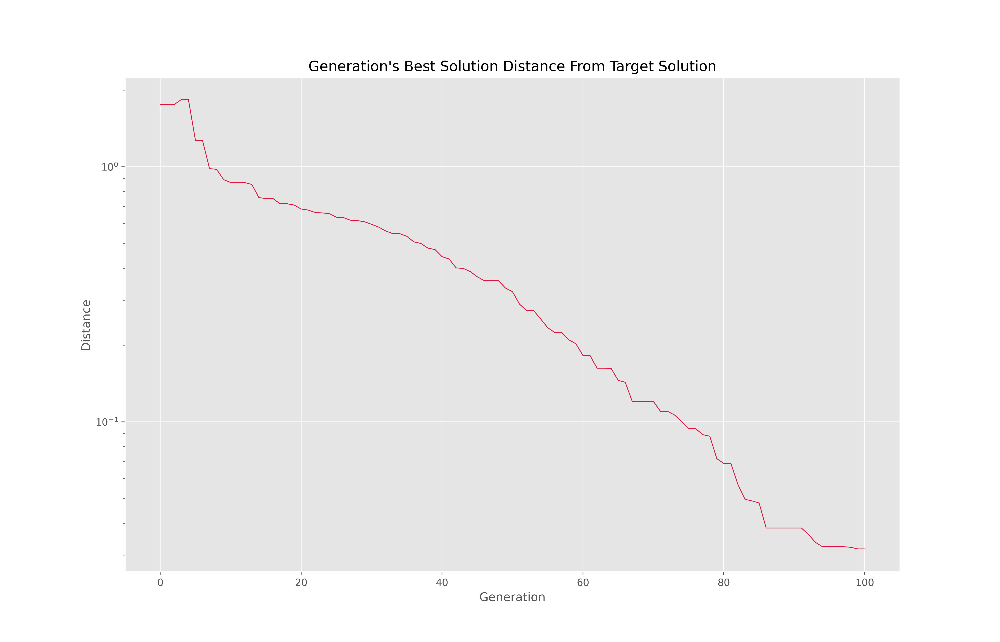
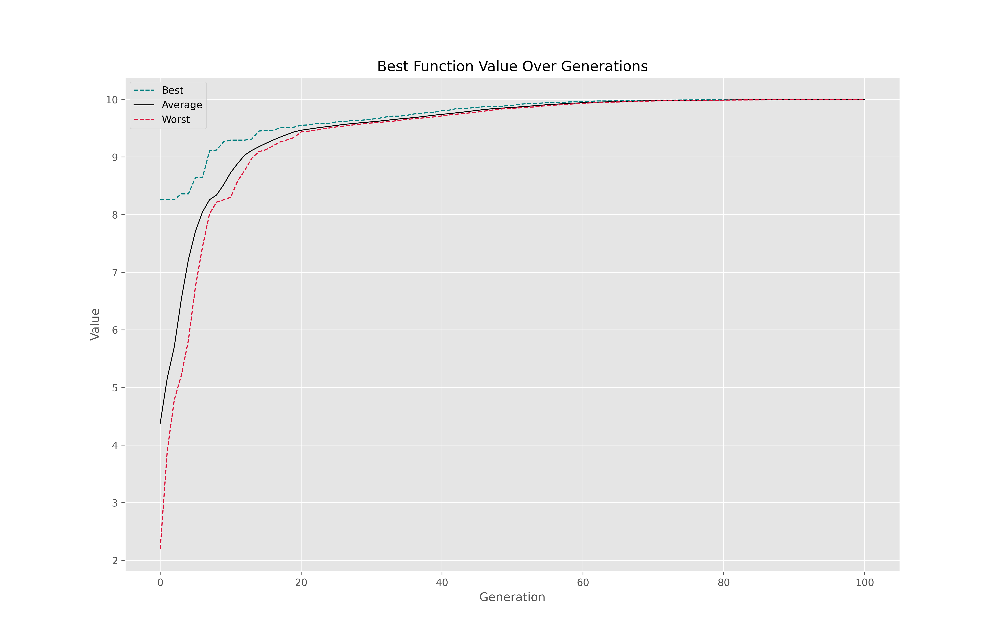
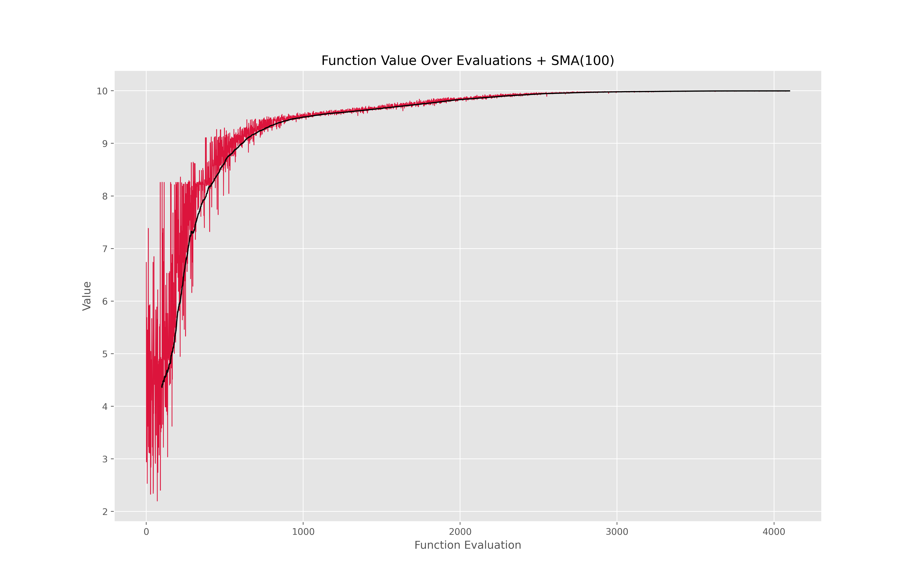
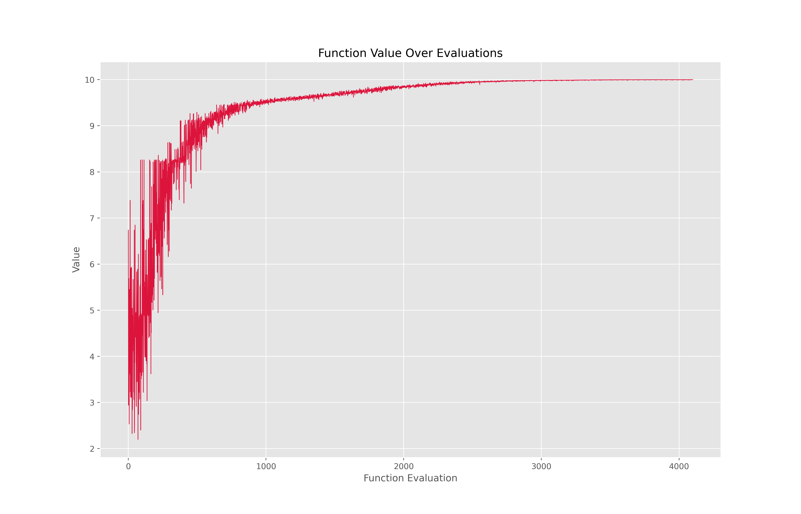

# Discrete & Continuous Evolutionary Optimization Toolkit (Genetic Algorithm)

An academic-grade, production-ready **Metaheuristic Optimization Infrastructure** engineered from scratch in Python. This toolkit provides a modular framework to solve complex combinatorial problems, featuring an object-oriented **0/1 Knapsack Problem Solver** alongside a continuous global function minimization engine.

The framework seamlessly balances exploration and exploitation dynamics by contrasting discrete binary penalty-based strings against high-dimensional continuous floating-point vectors.

---

## 📐 Mathematical Formulation & Operator Mechanics

### 1. Objective Function & Penalty Handling
To solve the constrained 0/1 Knapsack configuration where total weight must not violate the maximum carrying capacity ($W$), a dynamic constraint relaxation approach via penalty scaling ($\alpha$) is introduced:

$$\max \sum_{i=1}^{m} v_i x_i \quad \text{subject to} \quad \sum_{i=1}^{m} w_i x_i \le W$$

The fitness evaluation function drops illegal out-of-bound solutions by scaling structural weight violations into a negative linear penalty field:

$$\text{Fitness} = \sum_{i=1}^{m} v_i x_i - \alpha \cdot \max\left(\sum_{i=1}^{m} w_i x_i - W, 0\right)$$

### 2. Roulette Wheel Selection & Selection Pressure ($\beta$)
Parent chromosomes are selected via fitness-proportionate selection. To control convergence velocity and avoid premature saturation, an explicit selection pressure factor ($\beta$) is embedded into the exponential distribution layer:

$$p_i = \frac{e^{\beta \cdot F_i}}{\sum_{j=1}^{n_{pop}} e^{\beta \cdot F_j}}$$

To optimize runtime execution, the stochastic roulette wheel is mapped from a 2D circle onto a single-dimensional vector segment, enabling safe vector slicing:

$$\text{if } r \le p_1 \rightarrow p_1 \quad | \quad \text{if } r \le p_1 + p_2 \rightarrow p_2 \quad | \quad \text{if } r \le \sum_{k=1}^{3} p_k \rightarrow p_3$$

---

## 🚀 Structural Directory & Module Maps

The source codes align with SOLID software engineering designs, isolating the problem environment from the core metaheuristic evolutionary engine:

- **`genetic_algorithm_engine.py`:** Contains the generalized GA lifecycle execution thread handling dynamic parent routing, single/double-point crossover blocks, and stochastic bit-flip mutation vectors.
- **`chromosome_representation.py`:** Manages individual chromosome gene structures, randomized binary array generation, and localized custom fitness extraction hooks.
- **`optimization_problem_model.py`:** Defines the multi-variable vector space constraints, weight limits ($W=2500$), and maximum scaling matrices.
- **`knapsack_solver_with_plots.py`:** A fast, end-to-end discrete knapsack validator running 200 epochs to chart generational solution shifts.
- **`fitness_evaluator_with_sma.py`:** Implements continuous mathematical evaluations coupled with a 100-step **Simple Moving Average (SMA)** window to filter data noise during function convergence.

---

## 📊 Empirical Evaluation & Optimization Profiles

### 1. Knapsack Solution Generation History
The discrete optimization path reveals rapid fitness scaling in early generations before converging firmly at global peaks.

<p align="center">
  
</p>

### 2. Statistical Population Trends & SMA Filtering
Continuous global evaluations monitor the variance between the top-performing elitist individuals and the structural population averages, stabilized via real-time moving window averages.

<p align="center">
  
  
</p>

### 3. Localization Convergence Metric
Traces the Euclidean step distances of generational elite vectors relative to the absolute target solution coordinates over fixed evaluation intervals.

<p align="center">
  
</p>

---

## 💻 Installation & Verification

### 1. Fetch Repository
```bash
git clone [https://github.com/mrhashx/evolutionary-optimization-genetic-toolkit.git](https://github.com/mrhashx/evolutionary-optimization-genetic-toolkit.git)
cd evolutionary-optimization-genetic-toolkit
```

### 2. Verify Execution Paths
```Bash
python main_modular_orchestrator.py
python knapsack_solver_with_plots.py
```